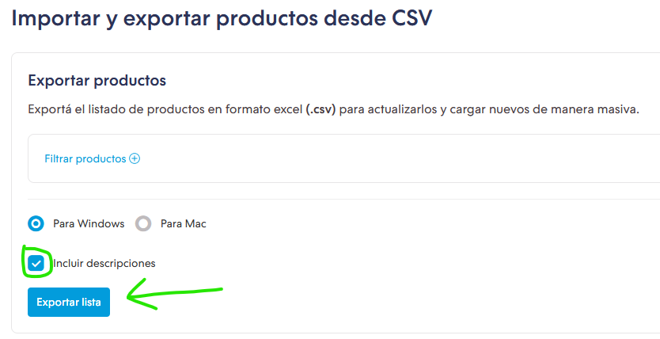

# TiendaNube2Contabilium

Script para convertir el CSV de productos de TiendaNube a un CSV compatible con Contabilium. Sirve para sincronizar los productos de TiendaNube con Contabilium.

## Uso

1. Descargar el CSV de productos de TiendaNube (Productos > Importar y exportar productos desde CSV) y guardarlo en la carpeta `data` del proyecto como `tiendanube_productos.csv`.
    
2. Ejecutar el script `tiendanube2contabilium.php` que generá el archivo `data/contabilium_productos.csv` con los productos convertidos al formato de Contabilium.
3. Importar en Contabilium el archivo `data/contabilium_productos.csv`.
